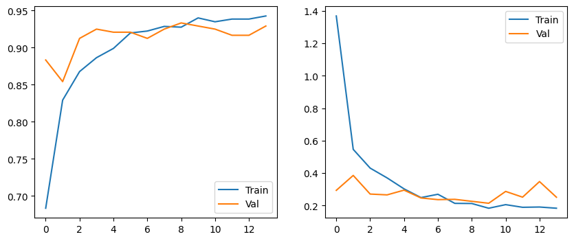
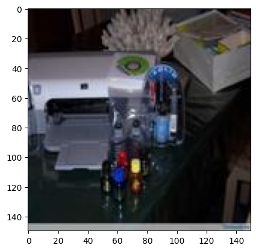

# E-Waste Image Classifier

A convolutional neural network that classifies photos of electronic waste into **10 categories**, built with transfer learning on **MobileNetV2**.

  

## Overview

The model takes a photo of a piece of e-waste (batteries, cables, PCBs, etc.) and predicts which of 10 waste types it belongs to — a first step toward automating e-waste sorting and recycling.

- **Architecture:** MobileNetV2 (transfer learning) + additional `Conv2D` / `MaxPooling2D` layers, with a softmax head over the 10 classes.
- **Data:** the raw dataset is split locally with `split-folders` into **train / validation / test = 80 / 10 / 10**.
- **Result:** ~**93% validation accuracy**, with training and validation curves tracking closely.

  

## Tech stack

Python · TensorFlow / Keras · MobileNetV2 · NumPy · Matplotlib · split-folders

## Notes

Final image-classification project for Dicoding's *Belajar Pengembangan Machine Learning*. The full workflow lives in [`Proyek_Akhir_Klasifikasi.ipynb`](./Proyek_Akhir_Klasifikasi.ipynb); `dataset.zip` is extracted automatically by the notebook.
